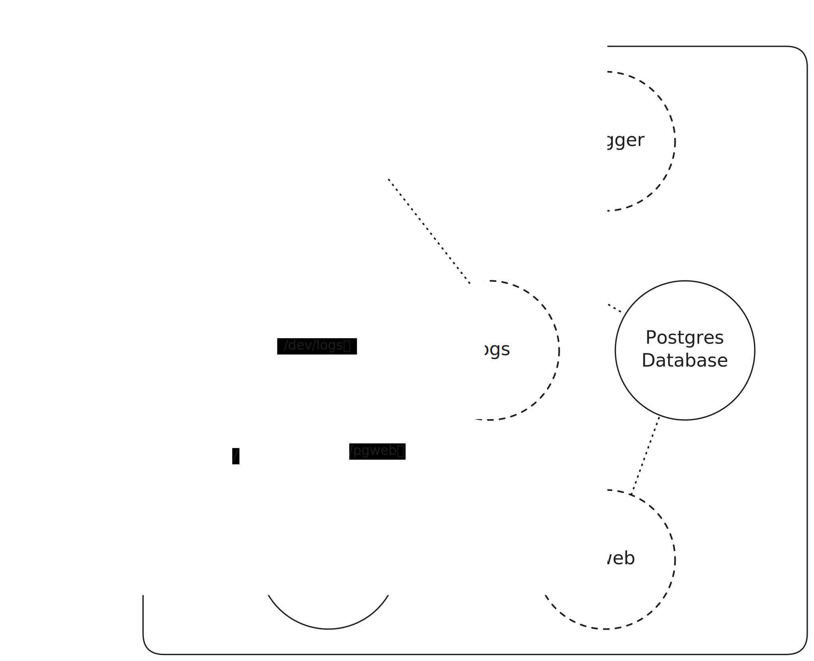

# Backend

The backend consists of the following components, the functionality of which the frontend can access via the [REST API](api):
- LTML Parser with HTML and PDF Backends, following the [Language Design](../language)
- [Version Control & Document Management](version-control)
- [User Management](user-management)

For code documentation, see [haddock](https://fpo.bahn.sh/dev/haddock).

For API documentation, see [swagger](https://fpo.bahn.sh/dev/purs).

## Architecture

All services are behind an nginx reverse proxy.

The following figure shows how the services are orchestrate.
Dottet lines represent internal communication, solid lines are externally reachable through the nginx reverse proxy. The labels represent the locations.

