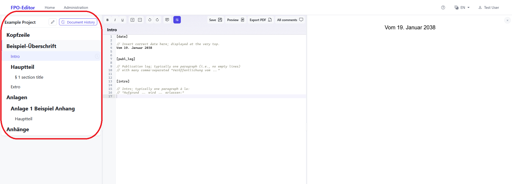
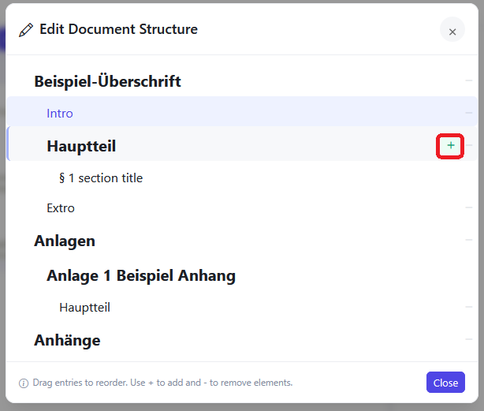
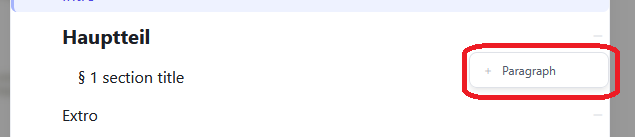
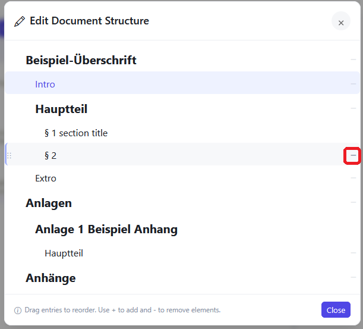
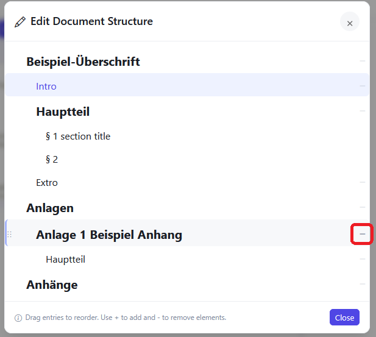
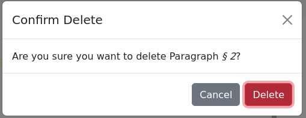

# Table of Content (TOC)

After creating a new project, you can access it by the home screen or the group interface. The left hand side displays the **Table of Content (TOC)** you can switch to a section by selecting the relevant point of content. 

## Parts of the TOC

| part     | function                                                                                                                            |
| -------- | ----------------------------------------------------------------------------------------------------------------------------------- |
| Heading  | The heading is set after the ! in this file                                                                                         |
| Intro    | The Intro gives space for the date of publication, a publication log and a short introduction.                                      |
| Haupteil | Here the main part of the content can be written                                                                                    |
| Extro    | This gives space for the date and name of the signatory, with space for the actual signature, as well as for the legal declaration. |
| Anlagen  | Here goes all text regarding the appendix section. Tables can be inserted here.                                                     |
| Anhänge  | This is the space for all necessary attachments                                                                                     |

## Adding a new section

You can add new sections of **Hauptteil**, **Anlagen** and **Anhänge**, by hovering over the respective heading and clicking on the plus that appears. And confirming the popup window. It does not matter how many section are added but new sections are always created by going to the respective heading and new last section will be created.

## Deleting a section

### In the Hauptteil

You can delete a section by hovering over the respective section in the **TOC** and clicking on the minus that appears.

### In the Anlagen/Anhänge

For the Anlagen and Anhänge you do not hover over the Hauptteil of the section in question but over the heading of the relevant Anlage/Anhang.

In both cases you have to confirm a popup to delete the section properly.

