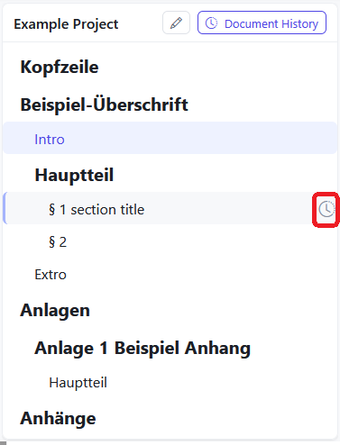
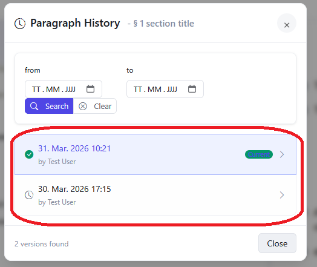
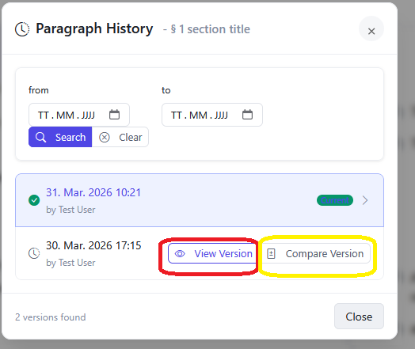

# Working with past versions

## Accessing a past version

1. Hover in the [TOC](toc) over the section you want to see the prior version of and click on the the appearing clock symbol.
   
2. Choose the version by clicking on one of the offered options. You can also filter the version by date with the top part of the pop-up.
   
3. Confirm your choice by clicking on **View Version**. Then the past version of the section will open in the editor. You can return by clicking **discard** in the top banner of the editor.
   
   Alternatively you can choose **Compare Version**. Then the source code of the past version will open on the right and and the current version will stay in the editor. To close the past version, click on the cross in the top right corner.
   

## Editing the past version

1. First open the past version in the editor as described above.
2. Make the desired changes and save the file.
3. Save the file by clicking on **Save** or CTRL+S
4. The Merge menu now opens. Add every change of the new version you to keep from the right side to the editor on the left.
5. Confirm by clicking **Merge**
