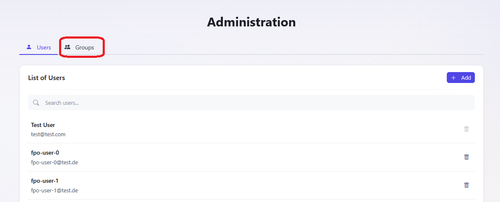
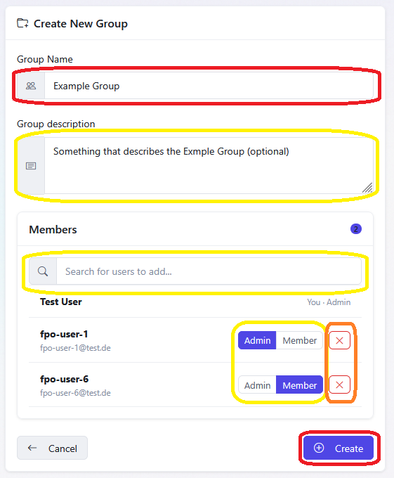
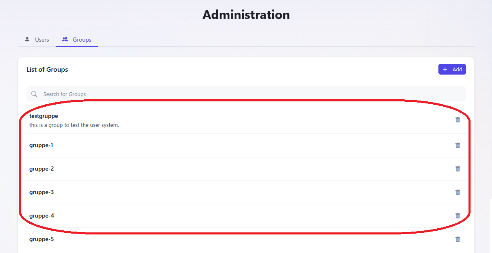
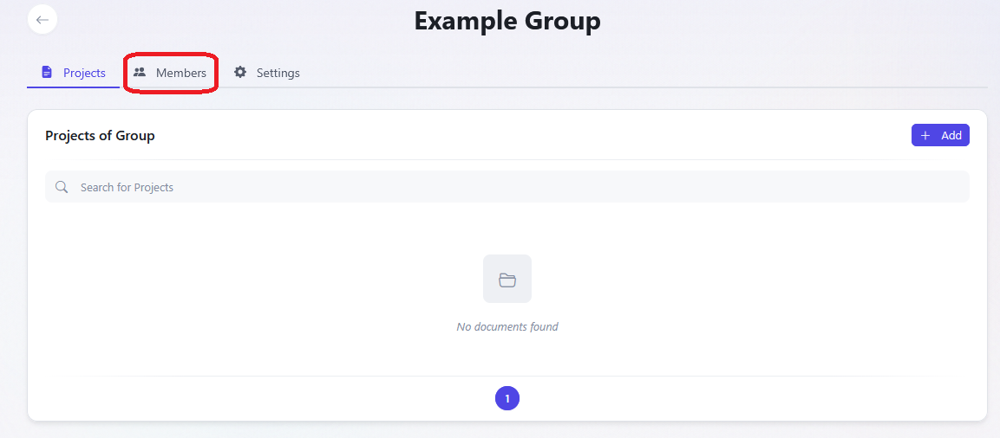
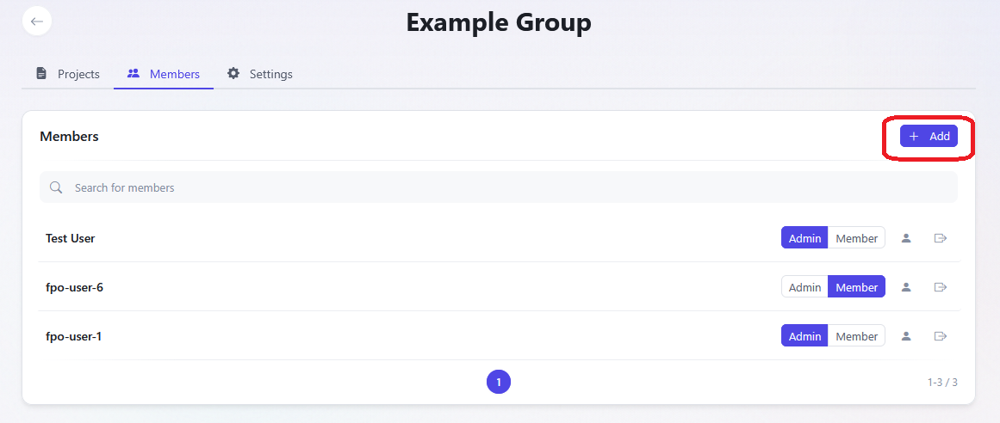
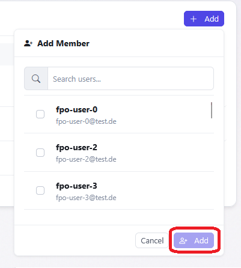
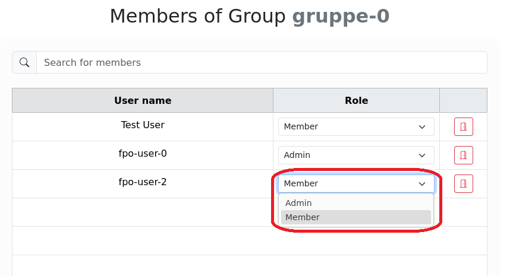
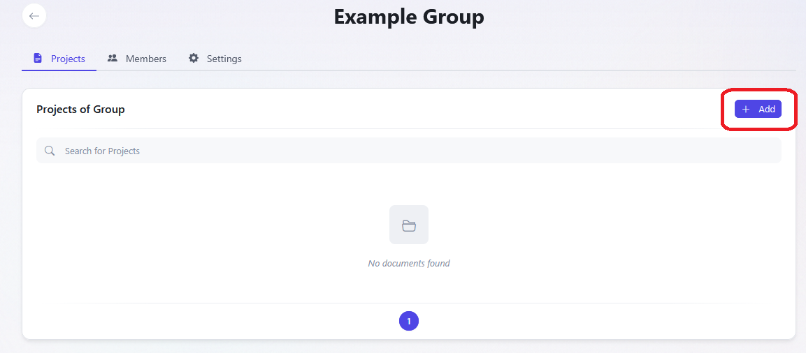
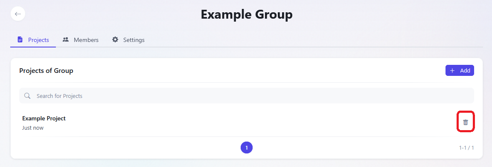

# Group Management

## Creating a new Group

1. Go to the Groups menu by clicking on the respective element of the navigation bar in the top left corner.
   
2. Next enter the desired group name in the name field of the **Create New Group** part and confirm with create.
   
3. Then a popup will appear where a optional group description can be added. After confirming the creation with **Create**, the group is added.

## Member Management

1. To manage the members of a group, first access the respective group by clicking on **groups** and choosing it from the **List of Groups**. If needed the groups can be filtered by name with the integrated search bar.
	1. .
	   
	2. .
	   
2. Go to the members section of the group by selecting the respective element on the left hand side.
   

### Add new Member

1. Go to the **Members** Page as described above.
2. Select **Add Member** on the left hand side.
   
3. Any Member can now be added by clicking on the blue **Add member to the Group** button on the right.
	1. The red button removes the respective member of the group on the other hand.
	2. Members can be searched by using the Filter menu on the left. You can search by name and/or email.
   

### Manage Roles

1. Go to the **Members** Page as described above.
2. To change the role of a member select the dropdown menu on the respective member and choose the new role.
	1. Members can be searched with the search bar above the list.
	2. Members can also be removed in this menu with the red door button on the right of the dropdown menu.
	

## Project Management

1. To manage the projects of a group, first access the respective group by clicking on **groups** and choosing it from the **List of Groups**. If needed the groups can be filtered by name with the integrated search bar.
	1. .
	   
	2. .
	   

### Project Creation

1. First go to the **project management** interface as described above.
2. Click on **Create Project** on the left hand side.
   
3. Enter the name of the project you want to create and confirm it with **Create**. All members of the group will have automatically access to this project and can edit it.

### Project Deletion

1. First go to the **project management** interface as described above.
2. You can delete project by clicking on the trash bin icon in of the projects in the project list.
   
