# Group Management

## Creating a new Group

1. Go to the Administration menu by clicking on the respective element of the navigation bar in the top left corner.
   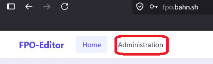
2. Then click on the field **Groups** to head to the Group menu.
	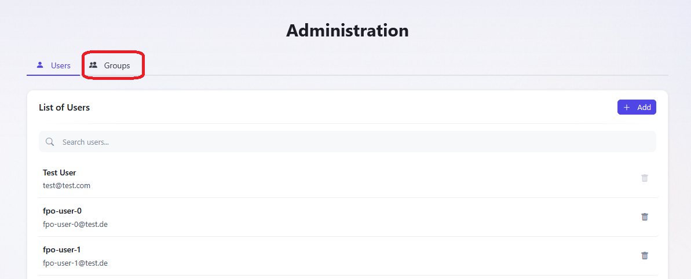
3. Click on the blue **Add** button in the top right. 
	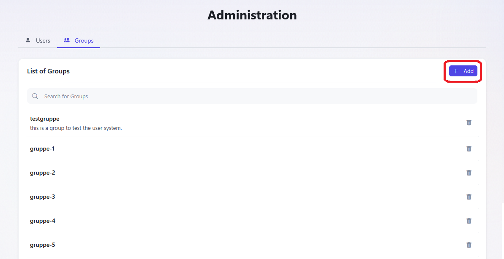
4. A new window will appear where you have to name the group and confirm the creation by clicking **Create**. Before comfirming with **Create** You may also optionally:  
	1.	Enter a group description for your group.
	2. Add members to the new group by using the searchbar below **Members** and the drop-down menu of that bar. (You are automatically part of the group).
	3.  The roles of the added members can be administrated with the **Admin**/**Member** toggle button on the right.
	4. If you added the the wrong member, you can remove them again with the cross on the very right of the menu.

   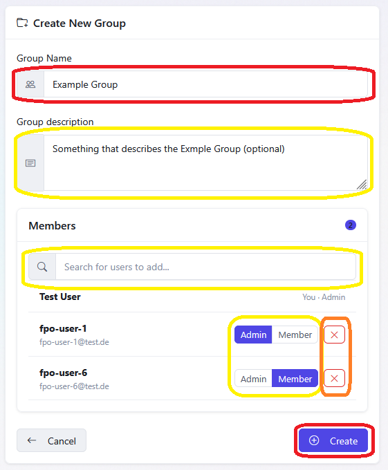

## Member Management

1. To manage the members of a group, first access the respective group by heading to the **Groups** menu as described in **1.** and **2.** in [Creating a new Group](#creating-a-new-group) and choosing it from the **List of Groups**. If needed the groups can be filtered by name with the integrated search bar.  
	1. 
	   
	2. 
	   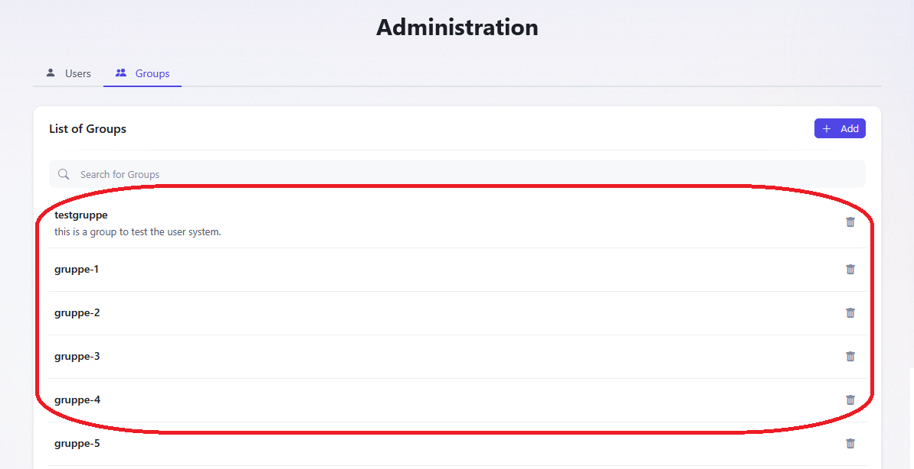
2. Go to the members section of the group by selecting the respective element on the left hand side.
   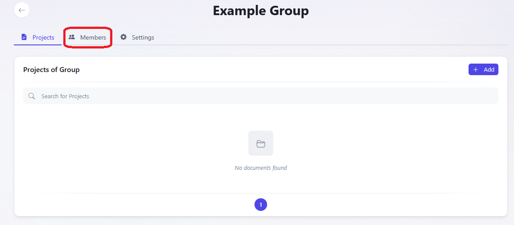

### Add new Member

1. Go to the **Members** Page as described above.
2. Select **Add** in the top right corner.
   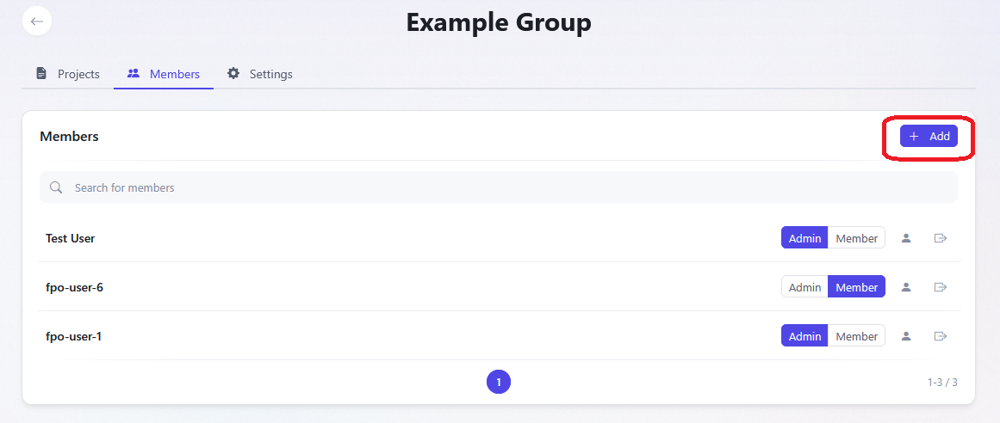
3. Any Member can now be added by clicking the checkbox on the left of the dropdown menu and confirmed by presseing **Add** in the bottom right corner.
	* Members can be searched by using the searchbar on the top. You can search by name or email.  
   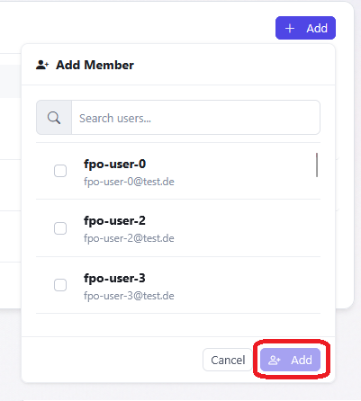

### Manage Roles

1. Go to the **Members** Page as described above.
2. To change the role of a member select the respective role of the member with the toggle button.
	1. Members can be searched with the search bar above the list.
	2. Members can also be removed in this menu with the red door button on the right of the dropdown menu.  
	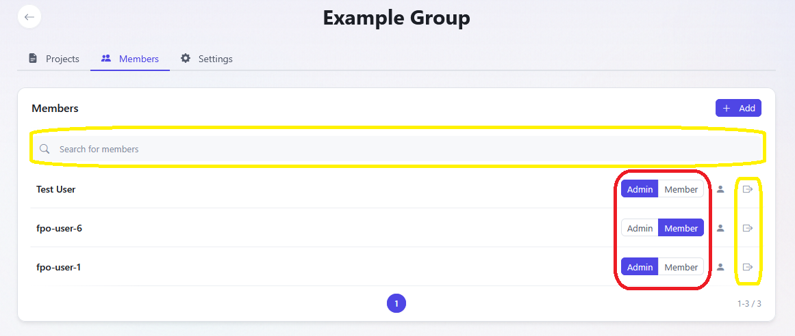

## Project Management

1. To manage the projects of a group, first access the respective group by clicking on **groups** and choosing it from the **List of Groups**. If needed the groups can be filtered by name with the integrated search bar.  
	1. 
	   
	2. 
	   

### Project Creation

1. First go to the **project management** interface as described above.
2. Click on **Create Project** on the left hand side.
   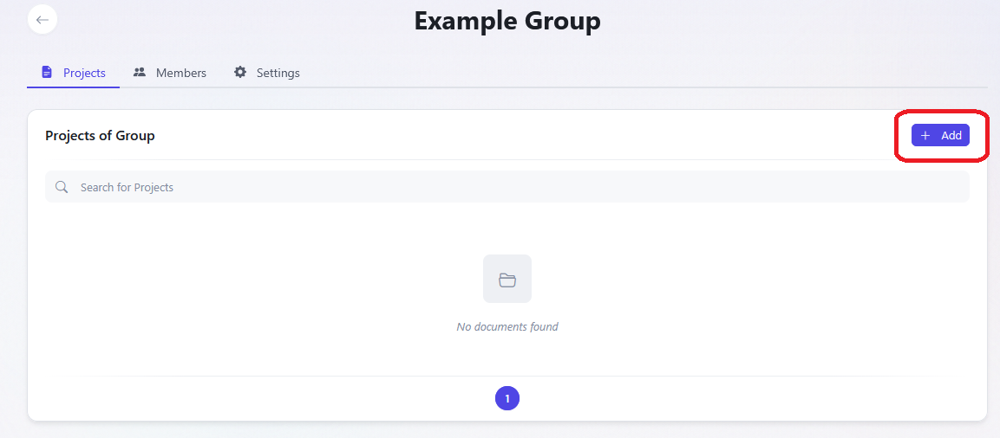
3. Enter the name of the project you want to create and confirm it with **Create**. All members of the group will have automatically access to this project and can edit it.

### Project Deletion

1. First go to the **project management** interface as described above.
2. You can delete project by clicking on the trash bin icon in of the projects in the project list and confirming with **Delete** in the pop-up.
   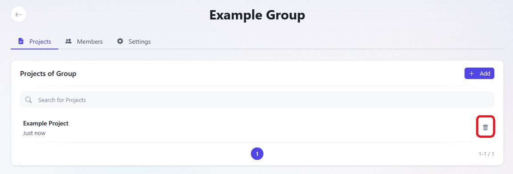
