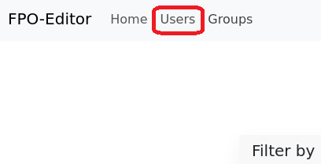
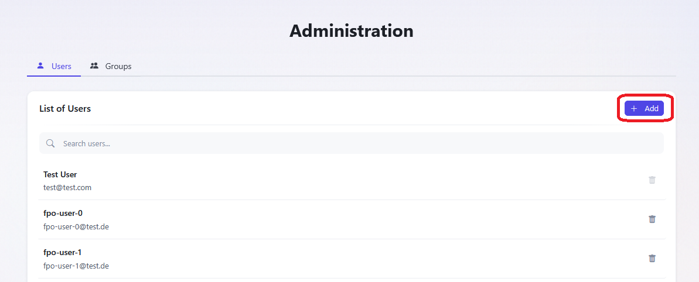
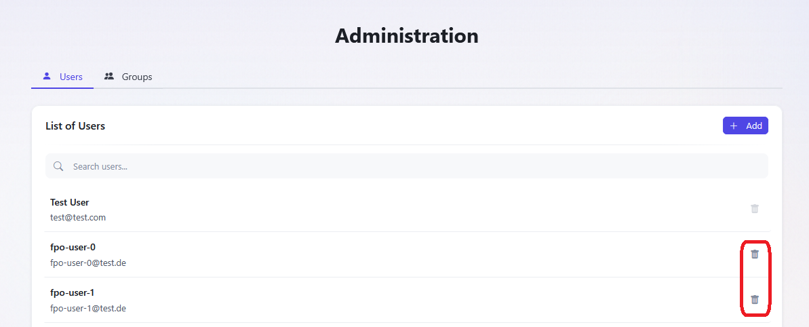

# User Management

## User Creation

1. Click on the **User** part of the navigation bar.
   
2. Enter the user name, email, and a provisional password of the respective user into the fields in the **Create New User** menu and confirm it by clicking on **Create**
   

## User Deletion

1. Click on the **User** part of the navigation bar.
   
2. Click on the red trash bin symbol on the right of the **List of Users** of the the respective user. You can search for a particular user with the **Filter by** window on the left, with the user name and/or the email.
   
