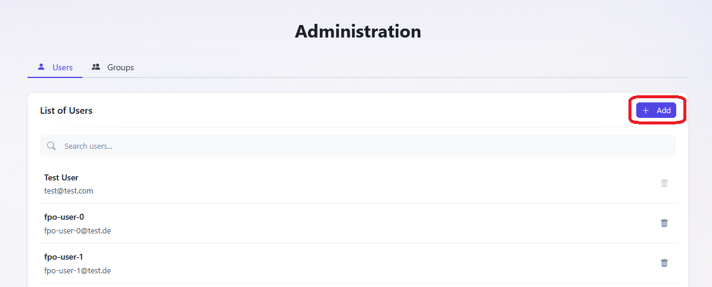
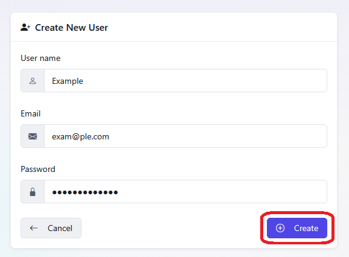
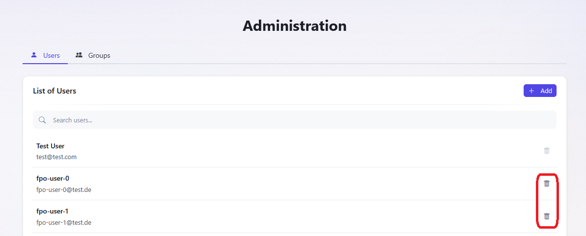

# User Management

## User Creation
1. Go to the Administration menu by clicking on the respective element of the navigation bar in the top left corner.
   
2. Click on the blue **Add** button in the top right corner.
   
3. Enter the user name, email, and a provisional password of the respective user into the fields in the **Create New User** menu and confirm it by clicking on **Create**
   

## User Deletion

1. Go to the Administration menu by clicking on the respective element of the navigation bar in the top left corner.
   
2. Click on the red trash bin symbol on the right of the **List of Users** of the the respective user. You can search for a particular user with the **Filter by** window on the left, with the user name and/or the email.
   
3. Confirm the deletion in the pop-up, with the red **Delete** button.
